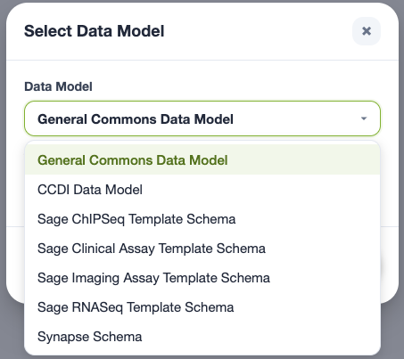
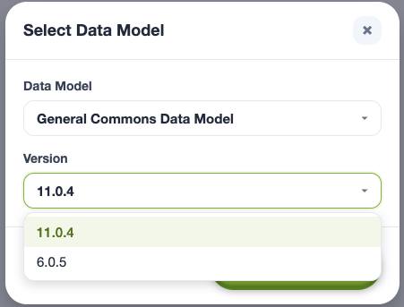
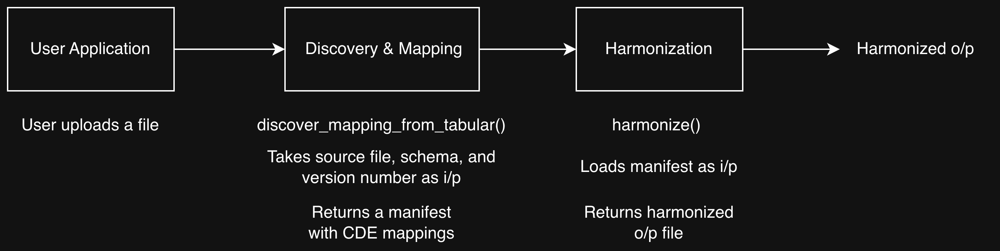

  

# Netrias Metadata Harmonization Tooling

> **Turn messy biomedical metadata into clean, standards-compliant records in just a few clicks.**

## 📢 Latest Updates

### Jun 1, 2026

**Data Chord is now available as a hosted early-access web application.** Users no longer need to install and run Data Chord locally for the no-code harmonization workflow.

- **Early-access web app:** [Open Data Chord](https://netrias-data-chord.netriasbdf.cloud/stage-1)
- **Authentication:** To request access, email [bdf_strides@netrias.com](mailto:bdf_strides@netrias.com) and include the email address you would like to use for authentication.
- **Verification emails:** After your email is added to the system, you should receive a verification email. These emails may land in spam or junk folders, so please look for messages from `no-reply@verificationemail.com`.
- **API keys:** API keys are only needed for the [Netrias Client](https://github.com/netrias/netrias_client) or direct REST API access. Data Chord uses email-based authentication.
- **Netrias Client:** Programmatic discovery, harmonization, and data model access are now available through the [Netrias Client](https://github.com/netrias/netrias_client).
- **Expanded file support:** The system now supports CSV, TSV, and Excel (`.xlsx`) files.
- **Updated UI:** The CDE recommendation step in the guided workflow has been updated to make it more intuitive and easier to navigate when working with a large number of input columns.
* **Upstream-aligned versioning:** Data model version numbers now follow the version labels used by the original upstream source models whenever possible. For example, General Commons versions such as `11.0.4` and `6.0.5` align with the corresponding CDS model versions from the CBIIT `cds-model` repository, making it easier to track Data Chord and Netrias Client selections with the source data model release.
- **Terminology:** This documentation now uses **data model** consistently as the generic term for the CDE collections available in Data Chord. Some official Data Chord labels still include the word “Schema” because that is part of the displayed data model name.
- **CDE recommendation coverage:** Data Chord can now recommend all available CDEs, including high-cardinality CDEs with large permissible value (PV) lists. Manual CDE selection is still available, but it is no longer required because of PV-list size.
- **General Commons updates:** General Commons Data Model version `11.0.4` now includes the completed permissible value updates for the previously noted CDEs.
- **Performance improvements:** Large harmonization jobs should be more reliable. In rare cases, a very large job may still fail; if that happens, retrying with smaller batches remains the recommended workaround.

> **Note:** Data Chord is still in active development, and the hosted link should be treated as an early-access environment.

### Feb 18, 2026

The Netrias Harmonization platform underwent a significant update as part of the first of several planned releases:

- **UI upgrade:** Our UI harmonization tool was significantly upgraded and renamed **Data Chord** (🎶 it harmonizes your data 🎶).
- **Netrias Client:** The Python client is now available as the [Netrias Client](https://github.com/netrias/netrias_client).
- **API updates:** We made major updates to the underlying API. API access is restricted for now, since most users will find Data Chord or the Netrias Client easier to use.
  - If you need API access, please reach out using the contact information on the **[API key request page](docs/requesting-API-key.md)**.

## ℹ️ About

The Netrias Harmonization platform provides a hosted user interface (Data Chord), the [Netrias Client](https://github.com/netrias/netrias_client), and REST endpoints for:

- **CDE discovery** – automatically get recommendations for which Common Data Element (CDE) should apply to each column in your dataset.
- **Value harmonization** – map free-text cell values to controlled vocabularies.
- **End-to-end pipelines** – batch-conform entire spreadsheets into standards-compliant outputs.

---

## 📚 Documentation Tour

Follow this sequence for a smooth onboarding experience. Each step links to a dedicated page with more information and examples.

| Step | Topic                         | File / Link                                                                 | Why read it first?                                     |
| :--: | ----------------------------- | --------------------------------------------------------------------------- | ------------------------------------------------------ |
|  1   | **What We Harmonize**         | [`what-we-harmonize.md`](docs/what-we-harmonize.md)                         | Learn the core concepts, CDEs, and supported data models. |
|  2   | **Open Data Chord**           | [Hosted early-access Data Chord](https://netrias-data-chord.netriasbdf.cloud/stage-1) | Start the no-code guided harmonization workflow.       |
|  3   | **Request Data Chord Access** | Email [bdf_strides@netrias.com](mailto:bdf_strides@netrias.com)             | Get your email added for hosted app authentication.    |
|  4   | **Request an API Key**        | [`requesting-API-key.md`](docs/requesting-API-key.md)                       | Required only for Netrias Client or direct REST API access. |
|  5   | **Use the Netrias Client**    | [Netrias Client GitHub repo](https://github.com/netrias/netrias_client)      | Programmatic discovery, harmonization, and data model access. |
|  6   | **Submit Your Own CDEs**      | [`requesting-data-be-added.md`](docs/requesting-data-be-added.md)           | Learn how to get a custom data model loaded into the platform. |

---

## 🚀 No-Code Getting Started

### 1 · Request Data Chord access

Email [bdf_strides@netrias.com](mailto:bdf_strides@netrias.com) and send the email address you would like to use for authentication.

After your email is added to the system, you should receive a verification email. These emails may occasionally land in spam or junk folders, so please look for messages from `no-reply@verificationemail.com`.

### 2 · Open the hosted Data Chord web app

Open the early-access hosted Data Chord app:

[https://netrias-data-chord.netriasbdf.cloud/stage-1](https://netrias-data-chord.netriasbdf.cloud/stage-1)

### 3 · Select a data model

Data Chord currently offers the following data models in the hosted early-access application:

  

For the **General Commons Data Model**, the current version selector includes `11.0.4` and `6.0.5`:

  

General Commons version `11.0.4` includes the completed permissible value updates for the previously noted high-impact CDEs, including therapeutic agents, diagnoses, morphology, and anatomical-site fields.

### 4 · Upload your first file

Data Chord currently supports CSV, TSV, and Excel (`.xlsx`) files.

### 5 · Follow the guided harmonization workflow

Data Chord is designed to guide you through harmonizing the columns of interest in your uploaded spreadsheet.

---

## Architecture Diagram

    

---

## 🧑‍💻 Developer Resources 

### Data Chord

The no-code workflow now uses the hosted Data Chord web application. General users no longer need to install or run Data Chord locally.

For programmatic access, use the **[Netrias Client](https://github.com/netrias/netrias_client)**. The Netrias Client provides Python access to discovery, harmonization, and data model services. Its installation and usage documentation is maintained in the client repository.

The local Data Chord GitHub repository is still available for development reference:

- [Data Chord GitHub repo](https://github.com/netrias/data_chord/tree/v1.0.0?tab=readme-ov-file#data-chord)

---

### Netrias Client & REST-API

We provide REST API access through Netrias Client, see the **[API key request guide/documentation](docs/requesting-API-key.md)**.

---

## ⚠️ Caveats / Known Limitations

### 1) CDE recommendation coverage

Data Chord can now recommend **all available CDEs**, including high-cardinality CDEs with large permissible value (PV) lists. There are currently **no PV-count-based restrictions** on which CDEs can be recommended.

Manual CDE selection is still available when users already know the target CDE, but it is no longer required as a workaround for large PV lists.

---

### 2) General Commons version `11.0.4` includes completed PV updates

The previously noted permissible value updates for the **General Commons Data Model** have been completed in version `11.0.4`. This includes the updated PV coverage for the high-impact CDE groups previously flagged for improvement, including therapeutic agents, diagnoses, morphology, and anatomical-site fields.

If you are working with General Commons data, we recommend using version `11.0.4` whenever possible.

If you encounter unexpected recommendations or value mappings, please open an issue and include the data model, version, column name, and a few sample values so we can reproduce and prioritize fixes.

---

### 3) Large harmonization jobs

Data Chord has been improved to better handle large harmonization jobs, and users should generally no longer encounter failures when harmonizing many unique values.

However, because Data Chord is still an early-access web application under active development, there is still a small chance that a very large job may fail. In these cases, you may see a **“harmonization job failed”** error after clicking **Harmonize**.

If this happens:

- Retry the harmonization job, or
- Reduce the number of columns you harmonize at one time and continue in smaller batches

Please open an issue if the problem persists so we can investigate the input size and failure mode.

---

## 🤔 Questions or Suggestions

Please open a GitHub issue in this repo with any questions, bugs, or feature requests:

- [Open an issue](https://github.com/netrias/bdf_harmonization/issues)

Our goal is to work closely with users and build tooling that helps them harmonize metadata faster, more efficiently, and more accurately.

---

## 💰 Funding

Generously supported by ARPA-H via funding from the [Biomedical Data Fabric (BDF) Toolbox](https://arpa-h.gov/explore-funding/programs/arpa-h-bdf-toolbox) program.

---

## 🤝 Contributing

We gladly accept pull requests that improve docs or examples in this repo. For Netrias Client changes, please use the [Netrias Client repo](https://github.com/netrias/netrias_client). Please open an issue first if you plan a large change.

---

## 📜 License

© 2026 Netrias LLC — Released under the Apache 2.0 license.
