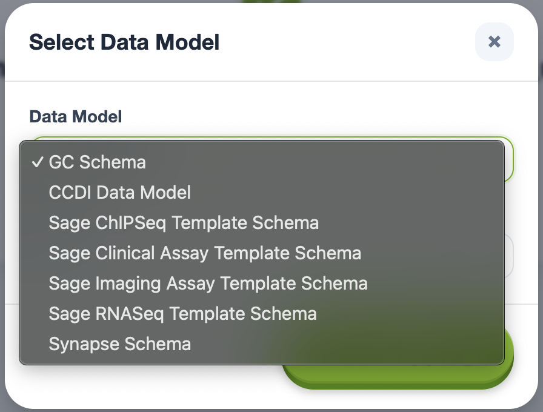

# Common Data Element and Schemas Overview

### What is a Common Data Element?
A **Common Data Element (CDE)** is a standardized, semantically defined data field - think of it as a spreadsheet column header whose meaning is precisely described. CDEs come in two varieties:

1. **With a controlled vocabulary** – also called *permissible values or standards*; only those values are considered valid.
2. **Without a controlled vocabulary** – any free‑text (or numeric) value is acceptable, though structure or validation rules may still apply.

#### Example – CDE *with* permissible values

```jsonc
{
  "embedding_medium": {
    "description": "A material that infiltrates and supports a specimen and preserves its shape and structure for sectioning and microscopy.",
    "permissible_values": [
      "Paraffin wax",
      "Carbowax",
      "Methacrylate",
      "Epoxy Resin (Araldite)",
      "Agar embedding",
      "Celloidin media",
      "Gelatin",
      "Other",
      "None",
      "Unknown"
    ]
  }
}
```

#### Example – CDE *without* permissible values

```jsonc
{
  "participant_id": {
    "description": "A number or string (potentially containing metadata) that uniquely identifies a participant in a study.",
    "permissible_values": []
  }
}
```

> **Analogy:** Treat the CDE (`embedding_medium`) as the column header and its permissible values (e.g., `Carbowax`, `Agar embedding`) as the valid entries in the rows beneath. For a CDE like `participant_id`, the rows can contain any value the data creator provides.

### What is a Schema?

A **schema** is an *ordered collection of CDEs* that work together to describe a particular data‑capture scenario, assay, or clinical study domain.
Think of a schema as the **template for a table**: each CDE defines one column, and the schema specifies which columns belong together, their order, validation rules, and version.

Key attributes of a schema:

| Attribute       | Description                                                                                                   |
| --------------- | ------------------------------------------------------------------------------------------------------------- |
| **Scope**       | The scientific or operational context it covers (e.g., RNA‑Seq metadata, clinical encounters).                |
| **CDE set**     | The complete list of CDEs — including those that reference controlled vocabularies and those that do not.       |
| **Version**     | Semantic version (e.g., `6.0.4`) that signals when CDE definitions or permissible values change.              |
| **Source**      | The authority that curates the schema (NCI, Sage Bionetworks, etc.).                                          |
| **Inheritance** | Schemas can extend or subset larger data models, inheriting parent CDEs but tailoring to a narrower use‑case. |

> **Analogy:** If a CDE is a column header, a *schema* is the entire spreadsheet template - laying out every column, its order, and the allowed values. Versioning guarantees that your data aligns with the same template your collaborators expect.

---

### Schemas Currently Available

Data Chord currently makes the following schemas available:
> **Note:** We use the term "Data Model" and "Schema" interchangably




#### The following table provides more details on the Schemas (Data Models) available through Data Chord

| Schema/Data Model | Version | CDE Count | Upstream model version / date | Source |
| ----------------- | ------: | --------: | ----------------------------- | ------ |
| GC Schema         | 1       | 245       | CDS model **v6.0.4** (~Apr 8, 2025) | NCI General Commons https://github.com/CBIIT/cds-model/blob/main/model-desc/cds-model-props.yml |
| GC Schema         | 2       | 245       | CDS model (Jan 29, 2026)      | NCI General Commons https://github.com/CBIIT/cds-model/blob/main/model-desc/cds-model-props.yml |
| CCDI Data Model   | 1       | 270       | —                             | NCI Childhood Cancer Data Initiative https://github.com/CBIIT/ccdi-model/blob/main/model-desc/ccdi-model-props.yml |
| Synapse Schema    | 1       | 299       | —                             | Sage Bionetworks https://github.com/nf-osi/nf-metadata-dictionary |
| NF-OSI RNA-Seq    | 1       | 69        | —                             | Sage Bionetworks https://github.com/nf-osi/nf-metadata-dictionary |
| NF-OSI Imaging Assay | 1    | 40        | —                             | Sage Bionetworks https://github.com/nf-osi/nf-metadata-dictionary |
| NF-OSI Clinical Assay | 1   | 43        | —                             | Sage Bionetworks https://github.com/nf-osi/nf-metadata-dictionary |
| NF-OSI ChIP-Seq   | 1       | 64        | —                             | Sage Bionetworks https://github.com/nf-osi/nf-metadata-dictionary |

### Loading Additional Schemas

Our platform is data model agnostic and can ingest virtually any well‑structured CDE collection. To request an import of your own CDEs and schema please reivew the [submission checklist and instructions](requesting-data-be-added.md).


### Changelog
* 2026-02-18 - Updated to descibe Schemas/Data Models available in Data Chord
* 2025‑07‑08 – Initial draft of CDE and Schema overview